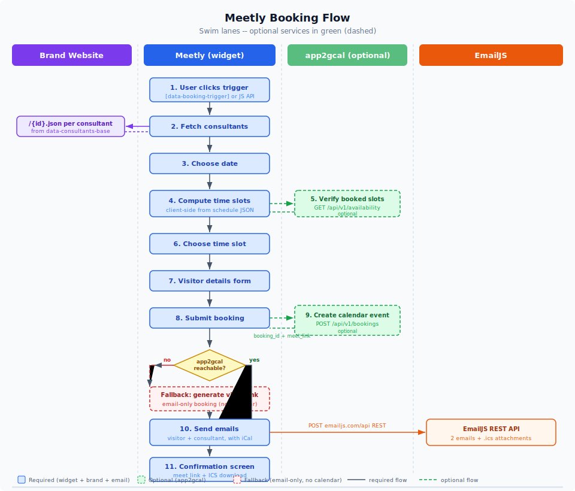

# booking-widget

Embeddable meeting booking widget. Vanilla JS, multi-brand, zero dependencies. Single `dist/widget.js` bundle (~48kb) with CSS inlined.

## Architecture

Two independent services:

| Service | Responsibility |
|---|---|
| **booking-widget** (this repo) | Frontend popup, consultant data, availability computation, email + iCal via EmailJS, auto-theme |
| **app2gcal** (separate repo) | Google Calendar event creation, booked-slot verification |



- Widget fetches consultant profiles from JSON files hosted on each brand's website
- Availability computed client-side from consultant schedules, then verified against app2gcal for already-booked slots
- Emails (visitor confirmation + consultant notification) with iCal attachments sent via EmailJS
- If app2gcal is unreachable, widget falls back to email-only booking with a private video conference link
- app2gcal handles only Google Calendar integration (no email)

## Widget flow

1. **Choose consultant** -- cards with photo, name, role, bio, LinkedIn link
2. **Choose date** -- month-grid calendar with prev/next navigation, grays out fully-booked days
3. **Choose time** -- morning/afternoon columns computed from consultant schedule
4. **Your details** -- 2-column form: name, email, company, multi-select topics, attendees, GDPR consent, honeypot
5. **Confirmation** -- 2-column layout: check icon + message left, summary + video link + ICS download right

## Embed

```html
<script src="https://booking.simplify-erp.de/widget.js"
        data-api="https://cal.google.wapsol.de"
        data-consultants-base="https://simplify-erp.de/data/consultants"
        data-consultants="C001,C002,C003"
        data-lang="de"
        data-brand="Simplify ERP"
        data-context-product="ERP Cloud"
        data-context-plan="Enterprise">
</script>
```

### Per-brand examples

**simplify-erp.de**
```html
<script src="https://booking.simplify-erp.de/widget.js"
        data-api="https://cal.google.wapsol.de"
        data-consultants-base="https://simplify-erp.de/data/consultants"
        data-consultants="C001,C002"
        data-lang="de"
        data-brand="Simplify ERP">
</script>
```

**re-cloud.io**
```html
<script src="https://booking.re-cloud.io/widget.js"
        data-api="https://cal.google.wapsol.de"
        data-consultants-base="https://re-cloud.io/data/consultants"
        data-consultants="C002,C003"
        data-lang="en"
        data-brand="RE Cloud">
</script>
```

**voltaic.systems**
```html
<script src="https://booking.voltaic.systems/widget.js"
        data-api="https://cal.google.wapsol.de"
        data-consultants-base="https://voltaic.systems/data/consultants"
        data-consultants="C004"
        data-lang="de"
        data-brand="Voltaic Systems">
</script>
```

**poweron.software**
```html
<script src="https://booking.poweron.software/widget.js"
        data-api="https://cal.google.wapsol.de"
        data-consultants-base="https://poweron.software/data/consultants"
        data-consultants="C004"
        data-lang="en"
        data-brand="PowerOn Software">
</script>
```

## Trigger buttons

Any element with `data-booking-trigger` opens the widget on click:

```html
<button data-booking-trigger>Termin buchen</button>

<a href="#" data-booking-trigger
   data-booking-consultant="C001"
   data-booking-topic="ERP Cloud">Talk to Anna</a>
```

Add `data-trigger="floating"` to the script tag for a fixed bottom-right CTA button.

## Consultant JSON

Each brand hosts JSON files at their `data-consultants-base` URL. Schema:

```json
{
  "id": "C001",
  "name": "Anna Becker",
  "role": "Senior ERP Consultant",
  "email": "anna.becker@simplify-erp.de",
  "phone": "+49 170 1234567",
  "photo": "https://simplify-erp.de/team/anna-becker.jpg",
  "linkedin": "https://www.linkedin.com/in/anna-becker",
  "bio": "10+ years ERP implementation experience",
  "schedule": {
    "mon": ["09:00-12:00", "14:00-17:00"],
    "tue": ["09:00-12:00", "14:00-17:00"],
    "wed": ["09:00-12:00", "14:00-17:00"],
    "thu": ["09:00-12:00", "14:00-17:00"],
    "fri": ["09:00-12:00", "14:00-16:00"]
  },
  "slotDuration": 30,
  "exceptions": {
    "2026-04-10": [],
    "2026-04-11": ["10:00-12:00"]
  }
}
```

| Field | Required | Description |
|---|---|---|
| `id` | yes | Alphanumeric ID (e.g. `C001`) |
| `name` | yes | Display name |
| `role` | no | Job title shown below name |
| `email` | yes | Used for iCal ORGANIZER and consultant notification email |
| `phone` | no | Contact phone |
| `photo` | no | Profile image URL, falls back to initials |
| `linkedin` | no | LinkedIn profile URL, shown as icon on right side of card |
| `bio` | no | Short description shown below role |
| `schedule` | yes | Weekly time ranges per day (`mon`-`sun`) |
| `slotDuration` | no | Minutes per slot (default 30) |
| `exceptions` | no | Date overrides. `[]` = fully blocked. Array of ranges = override that day |

Sample files in `consultants/` folder.

Alternatively, `data-consultants-url` can point to a single JSON array with all consultant objects (legacy mode).

## Availability

Availability is resolved in two stages:

1. **Client-side** -- slots computed from consultant `schedule` + `exceptions` (instant, no network)
2. **Backend verification** -- if `data-api` is set, widget async-checks app2gcal for already-booked slots and marks them unavailable

The calendar grid in step 2 also checks each day's schedule and grays out days with zero available slots.

## Fallback booking

If app2gcal is unreachable, the widget:
1. Generates a private video conference link from the consultant name (`vid.rocket.re-cloud.io/{name}`)
2. Sends booking emails via EmailJS with iCal attachments
3. Shows confirmation with a fallback message noting the booking was sent by email without live calendar verification

## Email (EmailJS)

Two emails sent per booking via [EmailJS](https://www.emailjs.com/) REST API:
- **Visitor**: confirmation with date, time, consultant, video link, iCal attachment
- **Consultant**: notification with visitor details, topic, context, iCal attachment

ICS includes VTIMEZONE (Europe/Berlin), ORGANIZER, ATTENDEE fields -- compatible with Google Calendar, Outlook, Apple Calendar.

See `docs/emailjs_setup.md` for template configuration.

## Auto theme detection

Widget probes the host page and adopts its font, primary color, CTA color and border-radius. Priority:

1. CSS defaults (styles.css)
2. Auto-detected host styles
3. Explicit `--sb-*` CSS variables set by host page

Disable with `data-theme="none"`. Override individual vars:

```css
:root {
  --sb-primary: #0077b5;
  --sb-cta: #de182b;
  --sb-font: 'Inter', sans-serif;
  --sb-radius: 12px;
}
```

## JS API

```js
SimplifyBooking.open({
  consultant: 'C001',            // optional, skip step 1
  topic: 'ERP rollout',          // optional, pre-select topic
  lang: 'en',                    // optional, override language
  context: { product: 'ERP' },   // optional, merged with auto-collected
  consultantsUrl: '...',         // optional, override data attribute
})

SimplifyBooking.close()
SimplifyBooking.ready  // boolean
SimplifyBooking.on('booking:confirmed', (data) => { ... })
```

## Events

| Event | Payload | When |
|---|---|---|
| `booking:confirmed` | `{ bookingId, consultant, date, time, meetLink, visitor, context, fallback? }` | Booking created |
| `booking:started` | `{ consultant?, context }` | Widget opened |
| `widget:closed` | `{}` | Widget dismissed |

`fallback: true` in the confirmed event means app2gcal was unreachable and booking was email-only.

## Data attributes

| Attribute | Required | Description |
|---|---|---|
| `data-api` | no | app2gcal backend URL (omit for email-only mode) |
| `data-consultants-base` | yes* | Base URL for consultant JSON files on brand website |
| `data-consultants` | yes* | Comma-separated consultant IDs (e.g. `C001,C002`) |
| `data-consultants-url` | legacy | Single JSON URL with all consultants |
| `data-lang` | no | `de` (default) or `en` |
| `data-brand` | no | Brand name (included in context and emails) |
| `data-consultant` | no | Pre-select consultant ID |
| `data-api-key` | no | API key for bookings endpoint |
| `data-theme` | no | `auto` (default) or `none` |
| `data-trigger` | no | `floating` for bottom-right CTA button |
| `data-emailjs-service` | no | EmailJS service ID (default: `service_01zc3pa`) |
| `data-emailjs-template` | no | EmailJS template ID fallback (default: `template_wafmb6q`) |
| `data-emailjs-template-visitor` | no | EmailJS template for visitor email |
| `data-emailjs-template-consultant` | no | EmailJS template for consultant email |
| `data-emailjs-key` | no | EmailJS public key (default: `jXwGkXBbqbOks2wJI`) |
| `data-context-*` | no | Custom context fields |

*Either `data-consultants-base` + `data-consultants` OR `data-consultants-url` is required.

## Source files

| File | Purpose |
|---|---|
| `src/widget.js` | Entry point, config, state, modal, booking flow, public API |
| `src/ui.js` | DOM rendering for all 5 steps, ICS generation |
| `src/api.js` | Fetch consultant JSONs, app2gcal availability/booking calls |
| `src/availability.js` | Client-side slot computation from schedule + exceptions |
| `src/email.js` | EmailJS REST API integration |
| `src/theme.js` | Host page style detection |
| `src/i18n.js` | DE + EN translations |
| `src/context.js` | Auto-collect page URL, UTM params, referrer, custom context |
| `src/styles.css` | All styles, `sb-` prefixed, CSS variables |

## Build

```bash
npm install
npm run build    # -> dist/widget.js (~48kb)
npm run dev      # watch mode
```

## Deploy

K8s manifests in `k8s/`. Serves `dist/widget.js` via nginx:alpine.

Ingress configured for: `booking.simplify-erp.de`, `booking.re-cloud.io`, `booking.voltaic.systems`, `booking.poweron.software`.
